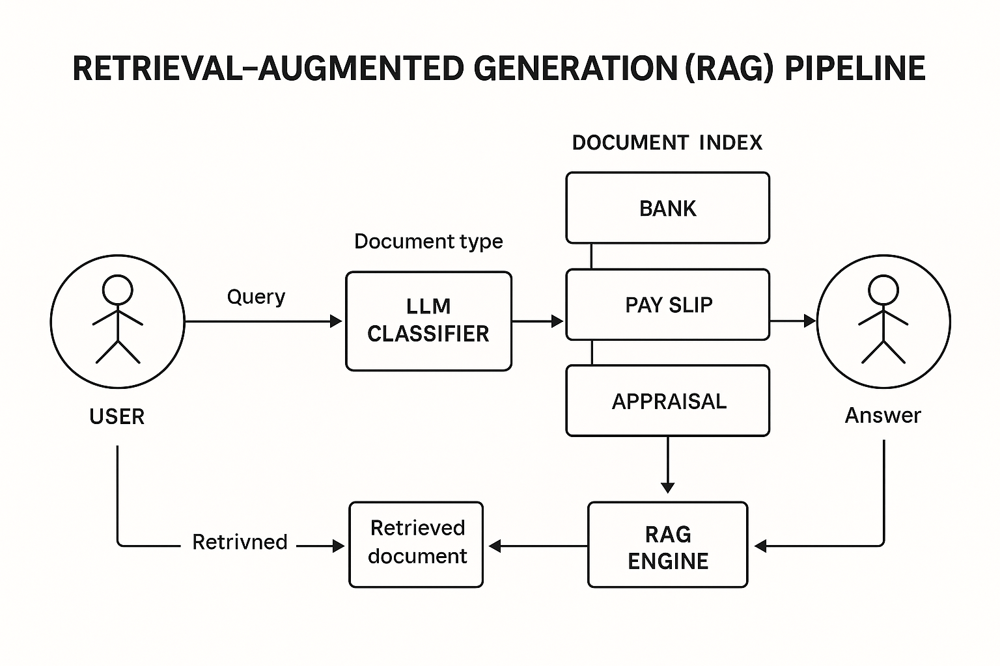

# SmartRAG_AI_ASST_Extern
#  Smart RAG: A Document-Aware AI Assistant

**Externship Project – Outamation | Extern Platform**  
_By Chelluri Sai Vishal (June 2025)_

A full Retrieval-Augmented Generation (RAG) system that classifies documents before answering user queries. The pipeline uses open-source tools like Mistral 7B, FAISS, MiniLM, and LangChain — all running locally in Colab without external APIs.

---

##  Overview

Smart RAG intelligently classifies documents like **Payslips**, **Bank Statements**, and **Appraisals** before routing user queries to the correct index. This ensures the system retrieves the most relevant content, improving both **speed** and **accuracy** of responses.

---

##  Architecture

User Query → LLM Classifier → Document Type → Relevant Index → RAG Engine → Answer

---

##  Features

- ✅ Document-type classification with **MiniLM embeddings**
- ✅ Retrieval routing to **per-type FAISS vector stores**
- ✅ Answer generation using **Mistral 7B** (local GGUF model)
- ✅ Optimized chunking: 1000 characters with 200 overlap
- ✅ Runs locally in Google Colab (GPU) using `llama-cpp-python`

---

##  Project Structure

├── Final_RAG_Pipeline_Vishal.ipynb # Main code notebook
├── sample_contract.pdf # Example input PDFs
├── bank_statement.pdf
├── payslip.pdf
├── rag_pipeline_architecture.png # Architecture image
├── README.md # Project summary

---

##  Sample Query Evaluation

| Query                             | Answered Correctly | Relevance | Time  |
|----------------------------------|---------------------|-----------|-------|
| What is the net salary?          |  Yes                |⭐⭐⭐⭐⭐| 3.5s  |
| How much was the last transaction? | Yes              |⭐⭐⭐⭐ | 1.0s  |
| What is the estimated home value? |  No                |❌        | —     |

 *Insight:* Misclassification leads to total failure → routing is crucial.

---

##  Tech Stack

- **Mistral 7B (GGUF)** – via `llama-cpp-python`
- **FAISS** – vector search for chunked document retrieval
- **MiniLM (SentenceTransformers)** – fast and semantic embeddings
- **LangChain** – integrates LLM with retrieval and prompt flow
- **PyMuPDF** – for PDF text extraction
- **Google Colab** – runtime for GPU testing

---

##  Lessons Learned

- Classification is *more important* than model size.
- Chunking and retrieval outweigh pure LLM power.
- Open-source LLMs like Mistral are production-ready with the right setup.

---

##  Future Work

-  Add **hybrid retrieval** (keyword + vector)
-  Integrate **reranking layer** using LLMs
-  Deploy using **Gradio** for live demo
-  Switch to **Qdrant or Weaviate** for persistent vector storage

---

>  _Project submitted for review under Outamation’s Externship via Extern. Repository is private until completion._

